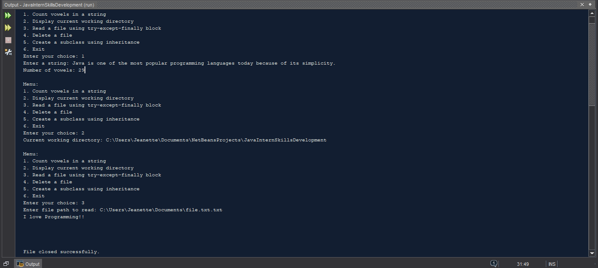
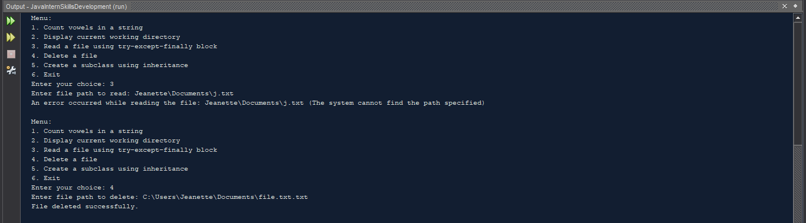
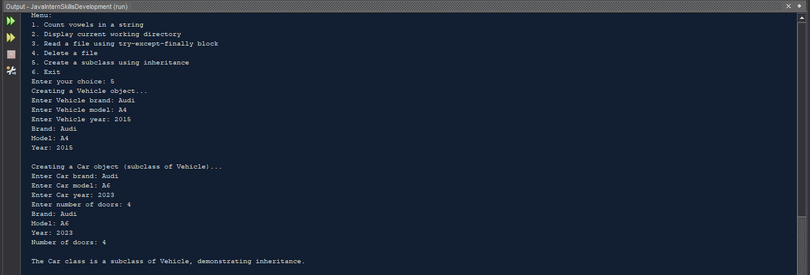
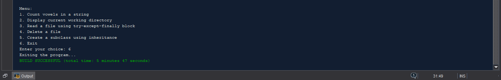

# JavaInternSkillsDevelopment

### Overview
This modular application  allows users to interact with various functionalities through a simple menu. The user can choose from several options, such as counting vowels, managing files, and showcasing inheritance in Java.

## Features

- Count vowels in a string.

- Display the current working directory.

- Delete a specified file.
  
- Read the contents of a specified file.
  
- Demonstrate the use of inheritance by creating a Car subclass from a Vehicle superclass.

## Usage
Run the MainApp class.
Follow the on-screen menu to select the desired operation.
Enter the required inputs as prompted by the application.

## Screenshots  of The output 

Below are the example outputs of each task:

*Figure 1: Screenshot of Count vowels in a string and Display the current working directory , Screenshot of Read the contents of a specified file *
  

*Figure 2: Screenshot of Read the contents of an invalid file , Delete a specified file*
  

*Figure 3: Screenshot of  Demonstrate the use of inheritance by creating a Car subclass from a Vehicle superclass.*
  

*Figure 4: Screenshot of Closing the program*
  

#### Licence
This project is licensed under the MIT License. See the [LICENSE](LICENCE) file for more details.
